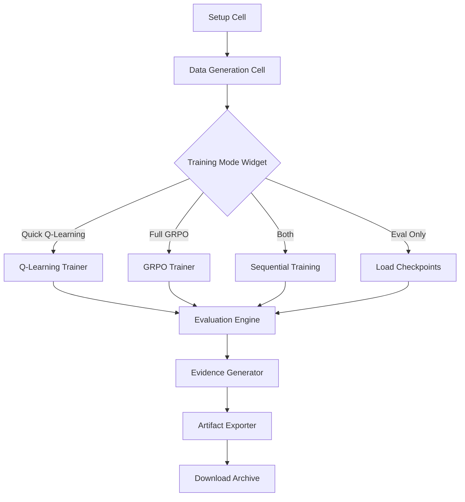

# Design Document: Google Colab Training Pipeline

## Overview

This design specifies a Google Colab Jupyter notebook that orchestrates the complete CivicMind training pipeline. The notebook provides an interactive, user-friendly interface for training both Q-learning (tabular RL) and GRPO (LLM-based RL) models, evaluating their performance, and exporting all artifacts for hackathon submission.

### Design Goals

1. **Zero-Setup Experience**: Users open the notebook and click "Run All" - no manual configuration required
2. **Fast Validation Path**: Q-learning training completes in <10 seconds for rapid pipeline validation
3. **GPU-Optimized GRPO**: Full LLM training completes in <45 minutes on Colab free tier (T4 GPU)
4. **Comprehensive Evidence**: Automatically generates all plots, metrics, and validation results
5. **One-Click Export**: Downloads complete artifact package ready for submission

### Key Design Decisions

- **Notebook-First Architecture**: All logic embedded in notebook cells for transparency and educational value
- **Progressive Disclosure**: Simple widgets hide complexity, advanced users can customize parameters
- **Fail-Safe Defaults**: Conservative batch sizes and timeouts prevent OOM errors on free tier
- **Modular Cell Structure**: Each major component in separate cells for independent execution and debugging

## Architecture

### High-Level Component Diagram



### Notebook Cell Organization

The notebook is structured into 12 major sections, each with specific responsibilities:


#### Cell 1: Header and Introduction
- **Purpose**: Display notebook title, description, and quick start instructions
- **Content**: Markdown cell with overview, expected runtime, and 3-step quick start guide
- **Estimated Runtime**: N/A (markdown only)

#### Cell 2: Environment Detection and Setup
- **Purpose**: Detect runtime environment (Colab/Kaggle/local) and install dependencies
- **Key Operations**:
  - Detect environment using `sys.modules` checks
  - Clone/mount CivicMind repository if not present
  - Install requirements.txt packages with progress bar
  - Verify critical imports (torch, transformers, datasets, peft)
- **Estimated Runtime**: 2 minutes
- **Error Handling**: Retry package installation up to 3 times, display specific failure messages

#### Cell 3: GPU Configuration and Verification
- **Purpose**: Configure CUDA, display GPU info, set device mode
- **Key Operations**:
  - Check `torch.cuda.is_available()`
  - Display GPU name, VRAM capacity
  - Set global `device` variable ("cuda" or "cpu")
  - Configure mixed precision (fp16) if GPU available
- **Estimated Runtime**: 5 seconds
- **Error Handling**: Warn if no GPU, continue in CPU mode

#### Cell 4: Training Mode Selection Widget
- **Purpose**: Interactive dropdown for user to select training mode
- **Widget Type**: `ipywidgets.Dropdown`
- **Options**:
  - "Quick Q-Learning" (10 sec, CPU-based, validation)
  - "Full GRPO" (45 min, GPU-based, LLM training)
  - "Both Sequential" (45 min, runs Q-learning then GRPO)
  - "Evaluation Only" (2 min, load existing checkpoints)
- **Additional Widgets**: Parameter customization form (epochs, batch_size, n_episodes)
- **Estimated Runtime**: N/A (user interaction)

#### Cell 5: Dataset Generation
- **Purpose**: Create synthetic training data for RL agents
- **Key Operations**:
  - Generate configurable number of samples (default: 500)
  - Create samples with 70% good / 30% bad action ratio
  - Include all 6 agent types with balanced distribution
  - Save to `training/civicmind_dataset.jsonl`
  - Display progress bar and statistics
- **Estimated Runtime**: 30 seconds for 500 samples
- **Error Handling**: Validate file write permissions, check disk space

#### Cell 6: Q-Learning Training
- **Purpose**: Train tabular RL model (fast validation path)
- **Key Operations**:
  - Initialize Q-table (state-action dictionary)
  - Run epsilon-greedy exploration (epsilon decay from 1.0 to 0.1)
  - Train for 2000 episodes with progress updates every 200 episodes
  - Save Q-table to `training/checkpoints/rl_policy.pkl`
  - Generate training curve plot
- **Estimated Runtime**: 10 seconds (CPU)
- **Error Handling**: Validate checkpoint directory exists, handle pickle serialization errors

#### Cell 7: GRPO Training
- **Purpose**: Train LLM-based RL model with Group Relative Policy Optimization
- **Key Operations**:
  - Load Qwen2.5-0.5B-Instruct model with LoRA adapters
  - Configure LoRA (r=16, alpha=32, target_modules=["q_proj", "k_proj", "v_proj", "o_proj"])
  - Train for 3 epochs with batch_size=2, n_samples_per_prompt=4
  - Use mixed precision (fp16) if GPU available
  - Display progress bar with loss, ETA, memory usage
  - Save model and tokenizer to `training/checkpoints/civicmind_grpo`
  - Generate loss curve plot
- **Estimated Runtime**: 45 minutes on T4 GPU
- **Error Handling**: Catch OOM errors, suggest batch size reduction, save checkpoint on interrupt

#### Cell 8: Model Evaluation
- **Purpose**: Compare trained models against baselines
- **Key Operations**:
  - Run 5 episodes each for: random baseline, heuristic baseline, trained policy
  - Use identical random seeds (42, 43, 44, 45, 46) for fair comparison
  - Measure: mean reward, final reward, survival rate, trust score, rebel spawn rate
  - Calculate improvement percentages
  - Save results to `evaluation/artifacts/training_results.json`
  - Display comparison table
- **Estimated Runtime**: 2 minutes
- **Error Handling**: Continue with partial results if one policy fails

#### Cell 9: Anti-Reward-Hacking Validation
- **Purpose**: Prove reward function robustness against exploitation
- **Key Operations**:
  - Run 5 anti-hacking tests:
    1. Inaction exploit (holding vs acting during crisis)
    2. Budget abuse (wasteful spending vs prudent allocation)
    3. Instability gaming (chaos creation vs stability)
    4. Crisis gaming (exploiting crisis mechanics)
    5. Reward consistency (same state-action pairs yield consistent rewards)
  - Compare exploit attempts vs proper behavior
  - Calculate penalty deltas
  - Save to `evidence/eval/anti_hacking_validation.json`
  - Display pass/fail status for each test
- **Estimated Runtime**: 1 minute
- **Error Handling**: Report partial results if tests fail

#### Cell 10: Evidence Package Generation
- **Purpose**: Generate all required plots and result files
- **Key Operations**:
  - Create directory structure (evidence/eval, evidence/plots, evaluation/artifacts)
  - Generate plots:
    - Training curve (reward over episodes)
    - Before/after comparison (trained vs baseline)
    - Loss curve (GRPO training loss)
  - Save JSON files:
    - training_results.json
    - per_agent_validation.json
    - anti_hacking_validation.json
  - Display summary report with file paths
- **Estimated Runtime**: 30 seconds
- **Error Handling**: Validate matplotlib backend, handle missing data gracefully

#### Cell 11: Artifact Export and Download
- **Purpose**: Package all outputs into downloadable archive
- **Key Operations**:
  - Create zip archive with timestamp name
  - Include: checkpoints, JSON results, plots, training logs
  - Display archive size and contents
  - Trigger download (Colab: `files.download()`, Kaggle: save to `/kaggle/working/`)
- **Estimated Runtime**: 10 seconds
- **Error Handling**: Check disk space, validate zip integrity

#### Cell 12: Summary and Next Steps
- **Purpose**: Display completion message and guide user to next actions
- **Content**: Markdown cell with success message, file inventory, and links to documentation
- **Estimated Runtime**: N/A (markdown only)

## Components and Interfaces

### Environment Setup Component

**Responsibility**: Detect runtime environment and install dependencies

**Interface**:
```python
class EnvironmentSetup:
    def detect_environment(self) -> str:
        """Returns 'colab', 'kaggle', or 'local'"""
        
    def install_dependencies(self, requirements_path: str) -> bool:
        """Install packages from requirements.txt, return success status"""
        
    def verify_imports(self) -> dict[str, bool]:
        """Verify critical imports, return {package: success}"""
        
    def get_environment_summary(self) -> dict:
        """Return Python version, PyTorch version, device type"""
```

**Implementation Details**:
- Use `'google.colab' in sys.modules` to detect Colab
- Use `os.path.exists('/kaggle')` to detect Kaggle
- Use `subprocess.run(['pip', 'install', '-r', requirements_path])` for installation
- Retry failed installations with exponential backoff (1s, 2s, 4s)

### Dataset Generator Component

**Responsibility**: Create synthetic training data

**Interface**:
```python
class DatasetGenerator:
    def __init__(self, n_samples: int = 500, good_ratio: float = 0.7):
        self.n_samples = n_samples
        self.good_ratio = good_ratio
        
    def generate_sample(self, agent_id: str, is_good: bool) -> dict:
        """Generate single training sample"""
        
    def generate_dataset(self) -> list[dict]:
        """Generate full dataset with progress updates"""
        
    def save_dataset(self, path: str) -> None:
        """Save dataset in JSONL format"""
        
    def get_statistics(self) -> dict:
        """Return dataset statistics"""
```

**Implementation Details**:
- Sample structure: `{"prompt": str, "completion": str, "agent_id": str, "is_good": bool}`
- Good actions: welfare investment, trust building, crisis response
- Bad actions: tax increases during low trust, riot control, inaction during crisis
- Use `tqdm` for progress bar updates every 100 samples

### Q-Learning Trainer Component

**Responsibility**: Train tabular RL model

**Interface**:
```python
class QLearningTrainer:
    def __init__(self, episodes: int = 2000, epsilon_start: float = 1.0, 
                 epsilon_end: float = 0.1, learning_rate: float = 0.1):
        self.episodes = episodes
        self.epsilon_start = epsilon_start
        self.epsilon_end = epsilon_end
        self.learning_rate = learning_rate
        self.q_table = {}  # {state_key: {action: q_value}}
        
    def get_state_key(self, observation: dict) -> str:
        """Convert observation to hashable state key"""
        
    def select_action(self, state_key: str, epsilon: float) -> str:
        """Epsilon-greedy action selection"""
        
    def update_q_value(self, state: str, action: str, reward: float, 
                       next_state: str) -> None:
        """Q-learning update rule"""
        
    def train(self) -> dict:
        """Run training loop, return statistics"""
        
    def save_checkpoint(self, path: str) -> None:
        """Save Q-table to pickle file"""
```

**Implementation Details**:
- State representation: discretize continuous values (trust, GDP, survival) into bins
- Epsilon decay: linear from epsilon_start to epsilon_end over episodes
- Q-learning update: `Q(s,a) = Q(s,a) + lr * (r + gamma * max_a' Q(s',a') - Q(s,a))`
- Progress updates every 200 episodes showing epsilon, states learned, avg reward

### GRPO Trainer Component

**Responsibility**: Train LLM-based RL model with Group Relative Policy Optimization

**Interface**:
```python
class GRPOTrainer:
    def __init__(self, model_name: str = "Qwen/Qwen2.5-0.5B-Instruct",
                 epochs: int = 3, batch_size: int = 2, 
                 n_samples_per_prompt: int = 4, learning_rate: float = 2e-5):
        self.model_name = model_name
        self.epochs = epochs
        self.batch_size = batch_size
        self.n_samples_per_prompt = n_samples_per_prompt
        self.learning_rate = learning_rate
        
    def load_model(self) -> tuple:
        """Load model and tokenizer with LoRA"""
        
    def compute_text_reward(self, response: str, agent_id: str, prompt: str) -> float:
        """Compute reward for generated response"""
        
    def grpo_step(self, prompts: list[str], agent_ids: list[str]) -> float:
        """GRPO training step: generate N samples, select best, update policy"""
        
    def train(self, dataset: list[dict]) -> dict:
        """Run training loop, return statistics"""
        
    def save_checkpoint(self, path: str) -> None:
        """Save model and tokenizer"""
```

**Implementation Details**:
- LoRA config: r=16, alpha=32, dropout=0.05, target_modules=["q_proj", "k_proj", "v_proj", "o_proj"]
- GRPO algorithm:
  1. For each prompt, generate N samples (n_samples_per_prompt=4)
  2. Compute reward for each sample
  3. Select best sample (group relative)
  4. Update policy to favor high-reward samples
- Reward shaping: positive for welfare/trust/crisis response, negative for force/inaction
- Mixed precision (fp16) if GPU available
- Progress bar with loss, ETA, memory usage

### Evaluation Engine Component

**Responsibility**: Compare policies and measure performance

**Interface**:
```python
class EvaluationEngine:
    def __init__(self, n_episodes: int = 5, max_weeks: int = 20, difficulty: int = 3):
        self.n_episodes = n_episodes
        self.max_weeks = max_weeks
        self.difficulty = difficulty
        
    def run_episode(self, policy_fn, seed: int) -> dict:
        """Run single episode, return metrics"""
        
    def evaluate_policy(self, policy_fn, policy_name: str) -> dict:
        """Run N episodes, return aggregate statistics"""
        
    def compare_policies(self, policies: dict[str, callable]) -> dict:
        """Compare multiple policies, return comparison table"""
        
    def save_results(self, path: str) -> None:
        """Save evaluation results to JSON"""
```

**Implementation Details**:
- Policies: random baseline, heuristic baseline, trained Q-learning, trained GRPO
- Metrics: mean reward, final reward, survival rate, trust score, rebel spawn rate
- Use identical seeds (42, 43, 44, 45, 46) for fair comparison
- Calculate improvement percentages: `(trained - baseline) / baseline * 100`

### Evidence Generator Component

**Responsibility**: Generate plots and validation results

**Interface**:
```python
class EvidenceGenerator:
    def __init__(self, output_dir: str = "evidence"):
        self.output_dir = output_dir
        
    def create_directories(self) -> None:
        """Create evidence directory structure"""
        
    def generate_training_curve(self, rewards: list[float], path: str) -> None:
        """Generate training curve plot"""
        
    def generate_comparison_plot(self, results: dict, path: str) -> None:
        """Generate before/after comparison plot"""
        
    def run_anti_hacking_tests(self) -> dict:
        """Run 5 anti-hacking validation tests"""
        
    def save_validation_results(self, results: dict, path: str) -> None:
        """Save validation results to JSON"""
        
    def generate_summary_report(self) -> str:
        """Generate markdown summary report"""
```

**Implementation Details**:
- Use matplotlib for plotting (set backend to 'Agg' for Colab compatibility)
- Training curve: line plot with reward on y-axis, episode on x-axis
- Comparison plot: grouped bar chart comparing policies
- Anti-hacking tests:
  1. Inaction exploit: compare "hold" vs action during crisis
  2. Budget abuse: compare wasteful vs prudent spending
  3. Instability gaming: compare chaos vs stability actions
  4. Crisis gaming: compare crisis exploitation vs proper response
  5. Reward consistency: verify same state-action pairs yield consistent rewards

### Artifact Exporter Component

**Responsibility**: Package outputs into downloadable archive

**Interface**:
```python
class ArtifactExporter:
    def __init__(self, output_dir: str = "civicmind_artifacts"):
        self.output_dir = output_dir
        
    def collect_artifacts(self) -> list[str]:
        """Collect all artifact file paths"""
        
    def create_archive(self, archive_name: str) -> str:
        """Create zip archive, return path"""
        
    def get_archive_info(self, archive_path: str) -> dict:
        """Return archive size and contents"""
        
    def trigger_download(self, archive_path: str) -> None:
        """Trigger download (Colab/Kaggle specific)"""
```

**Implementation Details**:
- Archive name format: `civicmind_results_YYYYMMDD_HHMMSS.zip`
- Include: `training/checkpoints/`, `evaluation/artifacts/`, `evidence/`
- Use `zipfile` module for archiving
- Colab download: `from google.colab import files; files.download(archive_path)`
- Kaggle: copy to `/kaggle/working/` for output

## Data Models

### Training Sample Model

```python
@dataclass
class TrainingSample:
    prompt: str              # Agent prompt with context
    completion: str          # Expected action/response
    agent_id: str           # One of 6 agent types
    is_good: bool           # Good (True) or bad (False) action
    reward_signal: float    # Expected reward (0.0 to 1.0)
```

### Episode Result Model

```python
@dataclass
class EpisodeResult:
    policy_name: str
    rewards: list[float]
    survival_rates: list[float]
    trust_scores: list[float]
    gdp_indices: list[float]
    rebel_spawned: bool
    rebel_defeated: bool
    weeks_survived: int
    city_collapsed: bool
    
    @property
    def mean_reward(self) -> float:
        return sum(self.rewards) / len(self.rewards)
    
    @property
    def final_reward(self) -> float:
        return self.rewards[-1]
```

### Evaluation Results Model

```python
@dataclass
class EvaluationResults:
    policy_name: str
    n_episodes: int
    mean_reward_avg: float
    final_reward_avg: float
    survival_avg: float
    trust_avg: float
    rebel_rate: float
    collapse_rate: float
    episode_results: list[EpisodeResult]
```

### Training Configuration Model

```python
@dataclass
class TrainingConfig:
    # Q-Learning
    q_episodes: int = 2000
    q_epsilon_start: float = 1.0
    q_epsilon_end: float = 0.1
    q_learning_rate: float = 0.1
    
    # GRPO
    grpo_model_name: str = "Qwen/Qwen2.5-0.5B-Instruct"
    grpo_epochs: int = 3
    grpo_batch_size: int = 2
    grpo_n_samples_per_prompt: int = 4
    grpo_learning_rate: float = 2e-5
    grpo_max_length: int = 512
    
    # Dataset
    dataset_samples: int = 500
    dataset_good_ratio: float = 0.7
    
    # Evaluation
    eval_episodes: int = 5
    eval_max_weeks: int = 20
    eval_difficulty: int = 3
```

## Error Handling

### Error Categories and Strategies

#### 1. Environment Setup Errors

**GPU Memory Insufficient**:
- **Detection**: Catch `torch.cuda.OutOfMemoryError`
- **Response**: Display error message suggesting batch size reduction
- **Recovery**: Offer to restart with batch_size=1 or CPU mode

**Package Installation Failure**:
- **Detection**: Check `subprocess.run()` return code
- **Response**: Display specific package name and error message
- **Recovery**: Retry up to 3 times with exponential backoff (1s, 2s, 4s)

**Model Download Failure**:
- **Detection**: Catch `requests.exceptions.RequestException` or `OSError`
- **Response**: Display error and suggest checking internet connection
- **Recovery**: Retry up to 3 times with exponential backoff

#### 2. Training Errors

**Training Interruption**:
- **Detection**: Catch `KeyboardInterrupt`
- **Response**: Save last valid checkpoint
- **Recovery**: Display recovery instructions (load checkpoint and resume)

**OOM During Training**:
- **Detection**: Catch `torch.cuda.OutOfMemoryError`
- **Response**: Save checkpoint, display error with batch size suggestion
- **Recovery**: Offer to restart with reduced batch size

**Invalid Checkpoint Path**:
- **Detection**: Check `os.path.exists()` before loading
- **Response**: Display error message with expected path
- **Recovery**: Offer to run training from scratch

#### 3. Evaluation Errors

**Policy Execution Failure**:
- **Detection**: Catch exceptions during policy execution
- **Response**: Log error, continue with remaining policies
- **Recovery**: Report partial results

**Environment Step Failure**:
- **Detection**: Catch exceptions during `env.step()`
- **Response**: Log error, mark episode as failed
- **Recovery**: Continue with next episode

#### 4. File I/O Errors

**Insufficient Disk Space**:
- **Detection**: Catch `OSError` with errno ENOSPC
- **Response**: Display error with required space estimate
- **Recovery**: Suggest deleting temporary files or using smaller dataset

**Permission Denied**:
- **Detection**: Catch `PermissionError`
- **Response**: Display error with file path
- **Recovery**: Suggest checking file permissions or using different directory

### Error Handling Implementation Pattern

```python
def safe_operation(operation_name: str, operation_fn: callable, 
                   max_retries: int = 3, fallback_fn: callable = None):
    """Generic error handling wrapper with retry logic"""
    for attempt in range(max_retries):
        try:
            return operation_fn()
        except Exception as e:
            if attempt < max_retries - 1:
                wait_time = 2 ** attempt
                print(f"⚠️  {operation_name} failed (attempt {attempt+1}/{max_retries}): {e}")
                print(f"   Retrying in {wait_time}s...")
                time.sleep(wait_time)
            else:
                print(f"❌ {operation_name} failed after {max_retries} attempts: {e}")
                if fallback_fn:
                    print(f"   Using fallback...")
                    return fallback_fn()
                raise
```

## Testing Strategy

### Testing Approach

This feature is a Jupyter notebook orchestration system with UI widgets, file I/O, model training workflows, and external dependencies. **Property-based testing is NOT appropriate** for this feature because:

1. **Infrastructure Orchestration**: Most operations are side-effect-only (training, file writing, downloads)
2. **UI Rendering**: Widget interactions and display logic are not suitable for PBT
3. **External Dependencies**: GPU availability, model downloads, and file system operations are environment-specific

Therefore, testing will focus on:
- **Unit tests**: Specific examples and edge cases for individual components
- **Integration tests**: End-to-end workflow validation
- **Manual testing**: UI interaction and visual verification

### Unit Testing Strategy

**Components to Unit Test**:

1. **EnvironmentSetup**:
   - Test environment detection (mock `sys.modules` and `os.path.exists`)
   - Test dependency verification (mock imports)
   - Test environment summary generation

2. **DatasetGenerator**:
   - Test sample generation for each agent type
   - Test good/bad action ratio
   - Test JSONL serialization
   - Test statistics calculation

3. **QLearningTrainer**:
   - Test state key generation (discretization)
   - Test epsilon-greedy action selection
   - Test Q-value update rule
   - Test checkpoint save/load

4. **GRPOTrainer**:
   - Test reward computation for various responses
   - Test LoRA configuration
   - Test checkpoint save/load

5. **EvaluationEngine**:
   - Test episode execution with mock environment
   - Test metric calculation
   - Test improvement percentage calculation

6. **EvidenceGenerator**:
   - Test directory creation
   - Test plot generation (verify file exists, not visual quality)
   - Test JSON serialization

7. **ArtifactExporter**:
   - Test artifact collection
   - Test zip archive creation
   - Test archive integrity

**Example Unit Test**:

```python
def test_dataset_generator_sample_distribution():
    """Test that dataset generator creates correct good/bad ratio"""
    generator = DatasetGenerator(n_samples=100, good_ratio=0.7)
    dataset = generator.generate_dataset()
    
    good_count = sum(1 for sample in dataset if sample["is_good"])
    bad_count = len(dataset) - good_count
    
    assert good_count == 70, f"Expected 70 good samples, got {good_count}"
    assert bad_count == 30, f"Expected 30 bad samples, got {bad_count}"
    
def test_q_learning_epsilon_decay():
    """Test that epsilon decays linearly over episodes"""
    trainer = QLearningTrainer(episodes=1000, epsilon_start=1.0, epsilon_end=0.1)
    
    epsilon_at_0 = trainer.get_epsilon(episode=0)
    epsilon_at_500 = trainer.get_epsilon(episode=500)
    epsilon_at_1000 = trainer.get_epsilon(episode=1000)
    
    assert epsilon_at_0 == 1.0
    assert 0.5 < epsilon_at_500 < 0.6  # Approximately 0.55
    assert epsilon_at_1000 == 0.1
```

### Integration Testing Strategy

**End-to-End Workflow Tests**:

1. **Quick Q-Learning Pipeline**:
   - Setup → Data Generation → Q-Learning Training → Evaluation → Export
   - Verify all files created
   - Verify training completes in <30 seconds
   - Verify improvement over random baseline

2. **Evaluation Only Pipeline**:
   - Setup → Load Checkpoints → Evaluation → Export
   - Verify checkpoint loading
   - Verify evaluation completes in <5 minutes

3. **Error Recovery**:
   - Simulate OOM error during training
   - Verify checkpoint saved
   - Verify recovery instructions displayed

**Example Integration Test**:

```python
def test_quick_q_learning_pipeline():
    """Test complete Q-learning pipeline end-to-end"""
    # Setup
    setup = EnvironmentSetup()
    assert setup.verify_imports()["torch"] == True
    
    # Data generation
    generator = DatasetGenerator(n_samples=100)
    generator.generate_dataset()
    generator.save_dataset("test_dataset.jsonl")
    assert os.path.exists("test_dataset.jsonl")
    
    # Training
    trainer = QLearningTrainer(episodes=100)
    stats = trainer.train()
    trainer.save_checkpoint("test_checkpoint.pkl")
    assert os.path.exists("test_checkpoint.pkl")
    assert stats["final_epsilon"] < stats["initial_epsilon"]
    
    # Evaluation
    evaluator = EvaluationEngine(n_episodes=2)
    results = evaluator.evaluate_policy(trainer.get_policy(), "Trained")
    assert results["mean_reward_avg"] > 0
    
    # Cleanup
    os.remove("test_dataset.jsonl")
    os.remove("test_checkpoint.pkl")
```

### Manual Testing Checklist

**UI and Interaction Testing**:
- [ ] Dropdown widget displays all training modes
- [ ] Parameter customization form accepts valid inputs
- [ ] Progress bars update during long operations
- [ ] Plots render correctly in notebook output
- [ ] Download triggers successfully in Colab
- [ ] Error messages display clearly

**Visual Verification**:
- [ ] Training curve shows upward trend
- [ ] Comparison plot shows trained > baseline
- [ ] Loss curve shows downward trend
- [ ] Summary table formats correctly

**Performance Testing**:
- [ ] Q-learning completes in <10 seconds
- [ ] GRPO completes in <45 minutes on T4 GPU
- [ ] Memory usage stays below 90% VRAM
- [ ] Archive creation completes in <10 seconds

### Test Execution Plan

1. **Development Phase**: Run unit tests after each component implementation
2. **Integration Phase**: Run integration tests after connecting components
3. **Pre-Release**: Complete manual testing checklist
4. **Release**: Provide test notebook for users to validate on their environment

### Test Coverage Goals

- **Unit Test Coverage**: 80% of component methods
- **Integration Test Coverage**: 100% of major workflows
- **Manual Test Coverage**: 100% of UI interactions

---

## Summary

This design provides a comprehensive blueprint for implementing the Google Colab training pipeline. The notebook architecture prioritizes user experience with zero-setup installation, interactive widgets, and comprehensive error handling. The modular cell structure allows independent execution and debugging, while the fail-safe defaults prevent common issues on free-tier Colab instances.

Key design strengths:
- **Fast validation path**: Q-learning completes in 10 seconds for rapid testing
- **GPU-optimized**: GRPO training completes in 45 minutes on T4 GPU
- **Comprehensive evidence**: Automatically generates all required plots and metrics
- **Robust error handling**: Graceful degradation and clear recovery instructions
- **Testing strategy**: Focused on unit tests and integration tests appropriate for notebook orchestration

The design is ready for implementation and will provide users with a seamless training experience from setup to artifact export.
