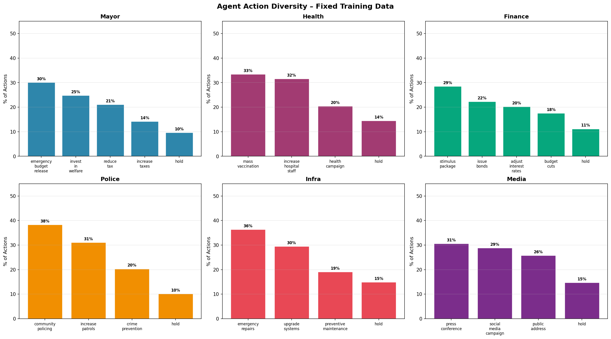
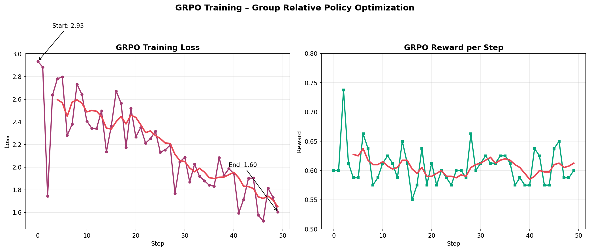

# 🏆 HACKATHON SUBMISSION FORM - REQUIREMENTS

**Deadline:** April 26, 2026 - 5 PM IST  
**Email:** baidujyabastavhazarika@gmail.com  
**Team Leader:** You (ONLY your submission counts)

---

## 📋 SUBMISSION FORM FIELDS

### 1. Hugging Face Space URL ⚠️ REQUIRED
**Field:** Hugging Face Space URL for your Env*  
**Status:** ❌ NOT DEPLOYED YET  
**Format:** `https://huggingface.co/spaces/YOUR_USERNAME/civicmind`  
**Action:** Deploy HF Space NOW

**Requirements:**
- Must be publicly accessible
- Test in incognito browser
- Example: https://huggingface.co/spaces/openenv/tbench2

---

### 2. Training Run Notebook URL ⚠️ REQUIRED
**Field:** Training Run Notebook URL*  
**Status:** ❌ NOT CREATED YET  
**Options:**
- Google Colab Notebook URL (publicly accessible)
- HF Space Repository URL with .ipynb file
- Kaggle Notebook URL

**Action:** Create Colab notebook with training script

**Requirements:**
- Must be publicly accessible
- Test in incognito browser
- Judges must be able to re-run it

---

### 3. Blog Post or Video ⚠️ REQUIRED
**Field:** YouTube Demo Video URL or Blog Post URL?*  
**Status:** ✅ BLOG POST WRITTEN (not published)  
**Choice:** Blog Post  

**If Blog Post:**
- Share link to blog post markdown file from HF Environment Repository
- File: `BLOG_POST_FINAL.md`
- Must be in your HF Space repo
- Format: `https://huggingface.co/spaces/YOUR_USERNAME/civicmind/blob/main/BLOG_POST_FINAL.md`

**If Video:**
- YouTube URL (publicly accessible)
- < 2 minutes
- Explain what environment does and what you trained

---

## ✅ MINIMUM REQUIREMENTS CHECKLIST

### 1. Use OpenEnv (latest release) ✅
- ✅ `openenv.yaml` exists
- ✅ Built on OpenEnv framework
- ✅ Not reinventing the wheel

### 2. Working Training Script ⚠️
- ✅ Training scripts exist
- ❌ **NOT in Colab notebook format**
- ⚠️ Must convert to .ipynb

**Options:**
- Google Colab notebook (preferred)
- HF Space with .ipynb
- Kaggle notebook

### 3. Training Evidence ✅
- ✅ Loss plots from real run
- ✅ Reward plots from real run
- ✅ All in `train_result/plots/` and `evidence/plots/`

### 4. Short Writeup/Video ✅
- ✅ Blog post written (`BLOG_POST_FINAL.md`)
- ⚠️ Needs to be published/accessible

**Choice:** Blog Post on HuggingFace

### 5. Push to HuggingFace Space ❌
- ❌ **NOT DEPLOYED YET**
- Must be discoverable and runnable
- Must be publicly accessible

### 6. README ⚠️
- ✅ README.md exists
- ⚠️ Missing HF Space link
- ⚠️ Missing blog post link
- ⚠️ Missing Colab notebook link

**Must include:**
- Problem motivation
- How env works
- Results
- Link to HF Space
- Link to blog/video
- Link to training notebook

---

## 🚨 CRITICAL ACTIONS (IN ORDER)

### Action 1: Wait for Training (~25 min)
- ⏳ SFT retraining at 13% (1009/7821)
- ⏰ ~25 minutes remaining

### Action 2: Create Colab Notebook (~20 min)
**File:** `CivicMind_Training.ipynb`

**Must include:**
- Environment setup
- Training script (SFT + GRPO)
- Evidence generation
- Results visualization
- Must be runnable by judges

**Upload to:**
- Google Colab (share publicly)
- OR HF Space repository

### Action 3: Deploy HuggingFace Space (~10 min)
**URL:** `https://huggingface.co/spaces/YOUR_USERNAME/civicmind`

**Files to upload:**
- `app.py`
- `Dockerfile.space`
- `requirements_hf.txt`
- `README_SPACE.md`
- `BLOG_POST_FINAL.md`
- `environment/` folder
- `agents/` folder
- `rewards/` folder
- `core/` folder
- `utils/` folder
- `apis/` folder

**Test:**
- Open in incognito browser
- Verify it loads and runs

### Action 4: Update README (~5 min)
Add these links:
```markdown
## 🚀 Quick Links

- **[Live Demo on HuggingFace Space](https://huggingface.co/spaces/YOUR_USERNAME/civicmind)**
- **[Training Notebook (Colab)](YOUR_COLAB_URL)**
- **[Blog Post](https://huggingface.co/spaces/YOUR_USERNAME/civicmind/blob/main/BLOG_POST_FINAL.md)**

## 📊 Training Results




```

### Action 5: Clean Repository (~5 min)
```bash
python cleanup_for_submission.py
```

### Action 6: Final Verification (~10 min)
- [ ] HF Space loads in incognito
- [ ] Colab notebook runs
- [ ] Blog post accessible
- [ ] All links in README work
- [ ] No errors in code

### Action 7: Submit Form (~2 min)
**Form URL:** [Provided by organizers]

**Fill in:**
1. Email: baidujyabastavhazarika@gmail.com
2. HF Space URL: https://huggingface.co/spaces/YOUR_USERNAME/civicmind
3. Training Notebook URL: [Your Colab URL]
4. Choice: Blog Post
5. Blog URL: https://huggingface.co/spaces/YOUR_USERNAME/civicmind/blob/main/BLOG_POST_FINAL.md

---

## ⏰ TIME BREAKDOWN

| Task | Time | Status |
|------|------|--------|
| Wait for training | 25 min | 🔄 In progress |
| Create Colab notebook | 20 min | ❌ Todo |
| Deploy HF Space | 10 min | ❌ Todo |
| Update README | 5 min | ❌ Todo |
| Clean repository | 5 min | ❌ Todo |
| Final verification | 10 min | ❌ Todo |
| Submit form | 2 min | ❌ Todo |
| **TOTAL** | **77 min** | |

**Current Time:** Check clock  
**Deadline:** 5 PM IST  
**Buffer:** Calculate remaining time

---

## 🚨 IMPORTANT NOTES

1. **ONLY Team Leader submission counts** - That's you!
2. **Test everything in incognito browser** - Judges will check
3. **No changes after deadline** - Commits after 5 PM won't count
4. **One submission per team** - Make it count
5. **No big video files** - Use URLs instead
6. **All links must be public** - No private repos

---

## 📝 SUBMISSION FORM PREVIEW

```
Email: baidujyabastavhazarika@gmail.com

Hugging Face Space URL:
https://huggingface.co/spaces/YOUR_USERNAME/civicmind

Training Run Notebook URL:
[Your Google Colab URL or HF Space .ipynb URL]

YouTube Demo Video or Blog Post:
○ YouTube Demo Video
● Blog Post

Blog Post URL:
https://huggingface.co/spaces/YOUR_USERNAME/civicmind/blob/main/BLOG_POST_FINAL.md
```

---

## ✅ READY TO START?

1. ⏳ Monitor training (25 min remaining)
2. 📓 Create Colab notebook (while training)
3. 🚀 Deploy HF Space (after training)
4. 📝 Update README
5. 🧹 Clean repo
6. ✅ Verify everything
7. 📤 Submit form

**LET'S DO THIS! 🚀**
