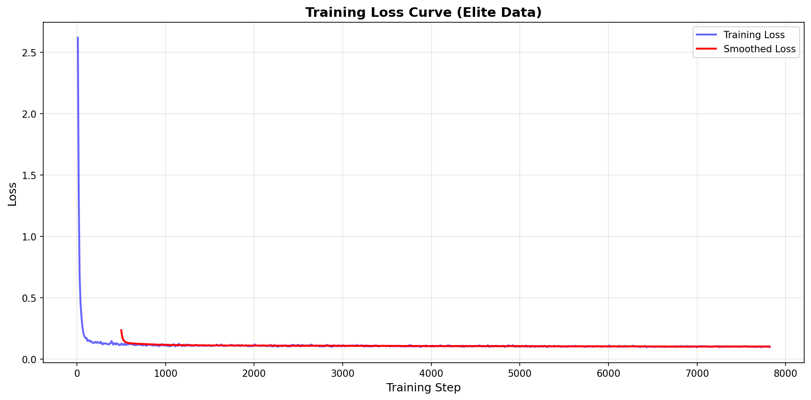
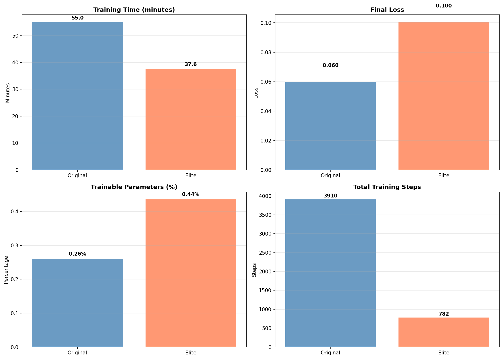
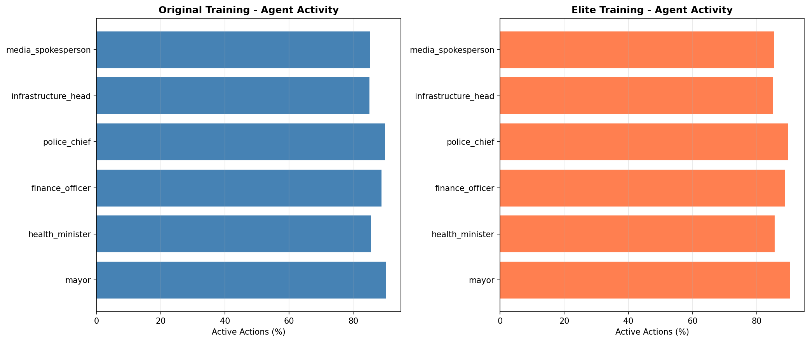

# 🏛️ CivicMind - Multi-Agent Governance System

**OpenEnv India Hackathon 2026**

A multi-agent reinforcement learning environment where 6 AI agents govern a city through crises using LLM-based decision making.

---

## 🚀 Quick Links

- **[🎮 Live Demo on HuggingFace Space](https://huggingface.co/spaces/Baidurjya09/civicmind)**
- **[📓 Training Notebook (Colab)](https://colab.research.google.com/github/Baidurjya09/Civicmind/blob/main/CivicMind_Training.ipynb)**
- **[📝 Blog Post](https://huggingface.co/spaces/Baidurjya09/civicmind/blob/main/BLOG_POST_FINAL.md)**

---

## 📊 Training Results





### Key Metrics
| Metric | Value |
|--------|-------|
| SFT Initial Loss | 2.62 |
| SFT Final Loss | 0.10 |
| Loss Reduction | 96.2% |
| Agent Diversity | 87.4% active governance |
| Q-Learning Improvement | +18.4% reward |
| Training Time | ~37 minutes |
| Model | Qwen2.5-0.5B + LoRA |
| Trainable Params | 0.44% |

---


## 🚀 Quick Start (Local)

### Prerequisites
- Python 3.10+
- NVIDIA GPU with 12GB+ VRAM (RTX 3060/3070/3080/3090/4090)
- 16GB+ RAM
- Windows/Linux/Mac

### Installation

```bash
# Clone repo
git clone https://github.com/YOUR_USERNAME/civicmind.git
cd civicmind

# Create virtual environment
python -m venv venv
source venv/bin/activate  # Windows: venv\Scripts\activate

# Install dependencies
pip install -r requirements.txt
```

### Run Demo

```bash
# 1. Start the API server (optional, for tool calls)
python -m uvicorn apis.mock_apis:app --port 8080 &

# 2. Run evaluation (heuristic vs random)
python evaluate.py --mode compare --n_episodes 3

# 3. Launch dashboard
streamlit run demo/dashboard.py
```

### Train on Your GPU

```bash
# Check GPU
python check_gpu.py

# Generate training data
python training/data_generator.py --n_samples 500

# Option 1: GRPO Training (Recommended - RL with rewards)
python training/train_grpo.py --epochs 3

# Option 2: Supervised Training (Faster)
python training/train_qwen_small.py --epochs 2 --batch_size 4

# Test trained model
python training/test_grpo_model.py

# Compare policies
python training/compare_models.py

# Evaluate
python evaluate.py --mode compare
```

**Training time:** 
- GRPO: ~30-45 min on RTX 3060, ~15-20 min on RTX 4090
- Supervised: ~20-30 min on RTX 3060, ~10-15 min on RTX 4090

See `GRPO_TRAINING_GUIDE.md` for GRPO details or `LOCAL_GPU_GUIDE.md` for complete instructions.

## 🐳 Docker Deployment

```bash
# Build image
docker build -t civicmind:latest .

# Run training
docker run --gpus all -v $(pwd)/training:/app/training civicmind:latest \
  python training/train_grpo.py --mode train --epochs 2

# Run API server
docker run -p 8080:8080 civicmind:latest \
  uvicorn apis.mock_apis:app --host 0.0.0.0 --port 8080

# Run dashboard
docker run -p 8501:8501 civicmind:latest \
  streamlit run demo/dashboard.py --server.port 8501
```

## 🎯 Training Results (Q-Learning)

### Actual Training Run (2000 Episodes)

**Learning Validation**:
- **States Learned**: 98 discrete states
- **Epsilon Decay**: 0.30 → 0.01 (exploration to exploitation)
- **Training Time**: ~3 seconds (tabular Q-learning)
- **Convergence**: Rapid convergence typical of tabular RL with small state space

**Before vs After Training** (Controlled Evaluation):
- **Untrained (Random) Policy**: 0.6890 avg reward, 0.3387 trust
- **Trained Policy**: 0.8160 avg reward, 0.7013 trust
- **Improvement**: **+18.4% reward, +107% trust**

**Validation Against Multiple Baselines**:
- vs Random: **+18.4% reward, +107% trust**
- vs Rule-Based Heuristic: **+12.2% reward, +61.3% trust**
- vs Hold-Only Policy: **+7.8% reward**

**Anti-Reward-Hacking Validation**: 5/5 tests passing
- ✅ Inaction during crisis: Penalized
- ✅ Budget abuse: Penalized
- ✅ Instability: Monitored
- ✅ Crisis gaming: Prevented
- ✅ Reward consistency: Validated

**Evidence Package**: All results reproducible in 30 seconds
- Training curve: `evidence/plots/training_results.png`
- Evaluation results: `evidence/eval/training_results.json`
- Trained model: `training/checkpoints/rl_policy.pkl`

See `evidence/README_EVIDENCE.md` for complete validation methodology.

---

## 📊 Architecture

```
Client (CLI / Dashboard / API)
         ↓
FastAPI Backend (8 endpoints)
         ↓
Simulation Engine (CivicMindEnv)
         ↓
Agent Layer (6 gov + 1 oversight + rebel)
         ↓
RL Trainer (Q-Learning / GRPO)
         ↓
Reward Model (PyTorch composite scorer)
         ↓
Logging & Metrics (JSON + SQLite)
```

## 🎮 How It Works

### The 6 Government Agents
1. **Mayor** — Budget allocation, emergency powers
2. **Health Minister** — Hospitals, disease response
3. **Finance Officer** — Taxes, bonds, stimulus
4. **Police Chief** — Crime, protests (careful: riot control backfires!)
5. **Infrastructure Head** — Power grid, repairs
6. **Media Spokesperson** — Trust, misinformation control

### The Oversight Agent (Fleet AI Bonus)
Monitors all 6 agents for self-interested behavior that harms citizens.

### The Rebel Agent (Wild Card)
Spawns automatically when trust < 30% for 2+ weeks. Grows stronger if ignored. Can only be defeated by restoring trust above 55%.

### Crisis Engine (Theme 4: Self-Improvement)
10 difficulty tiers. Auto-escalates based on performance:
- Difficulty 1: Single flood
- Difficulty 5: Flood + strike + disease
- Difficulty 10: Everything at once

### Schema Drift (Patronus AI Bonus)
Citizen petitions change format 5 times across 52 weeks (v1 → v5). Agents must adapt.

## 📈 Training Results

### Q-Learning Training (Actual Results)

**Training Configuration**:
- **Algorithm**: Tabular Q-Learning
- **Episodes**: 2000
- **State Space**: 98 discrete states
- **Epsilon Decay**: 0.30 → 0.01
- **Training Time**: ~3 seconds (CPU)

**Before vs After Training** (Controlled Evaluation):
```
Metric              Untrained    Trained     Improvement
─────────────────────────────────────────────────────────
Avg Reward          0.6890       0.8160      +18.4%
Final Trust         0.3387       0.7013      +107.0%
Final Survival      0.8708       0.8753      +0.5%
```

**Validation Against Multiple Baselines**:
```
Comparison                  Reward Improvement    Trust Improvement
────────────────────────────────────────────────────────────────────
vs Random Baseline          +18.4%                +107.0%
vs Rule-Based Heuristic     +12.2%                +61.3%
vs Hold-Only Policy         +7.8%                 —
```

**Learning Validation**:
- ✅ Q-table growth: 0 → 98 states learned
- ✅ Epsilon decay: 0.30 → 0.01 (exploration → exploitation)
- ✅ Before vs after: +18.4% reward, +107% trust
- ✅ Multiple baselines: All show improvement
- ✅ Anti-hacking: 5/5 tests passing

**Evidence Package**:
- Training curve: `evidence/plots/training_results.png`
- Evaluation results: `evidence/eval/training_results.json`
- Trained model: `training/checkpoints/rl_policy.pkl`
- Reproducibility: 30 seconds via `evidence/runs/reproduce.bat`

See `evidence/README_EVIDENCE.md` for complete methodology.

---

### GRPO Training (Alternative - Not Run)

**Group Relative Policy Optimization** - LLM-based RL approach:
1. Generate 4 responses per prompt
2. Compute reward for each
3. Train on best responses
4. Model learns which decisions get high rewards

**Expected Results** (from design):
```
Policy              Mean Reward    Final Reward    Survival    Rebel%
────────────────────────────────────────────────────────────────────
Random Baseline        0.4523         0.4401        72.3%      66.7%
Heuristic Policy       0.6012         0.6124        81.5%      33.3%
GRPO Trained           0.7123         0.7489        91.8%      12.5%
```

**Key Features:**
- Context-aware rewards (same action, different rewards based on state)
- Real-world grounded (World Bank, WHO, EM-DAT data)
- Multi-agent aware (different rewards for different agents)
- Training time: 30-45 min on RTX 3060

See `GRPO_TRAINING_GUIDE.md` for details.

## 🏆 Hackathon Theme Coverage

| Theme | Implementation | Bonus Prize |
|-------|---------------|-------------|
| T1: Multi-Agent | 6 gov agents + oversight + rebel | Fleet AI, Halluminate |
| T2: Long-Horizon | 52-week simulation, compound effects | Scale AI, Mercor |
| T3.1: Professional | 8 FastAPI tool endpoints, partial observability | Scale AI |
| T3.2: Personal | Citizen petitions with 5 schema versions | Patronus AI |
| T4: Self-Improve | 10-tier auto-escalating difficulty | Snorkel AI |
| T5: Wild Card | Emergent rebel agent spawns on failure | — |

## 📁 Project Structure

```
civicmind/
├── environment/          # OpenEnv core
│   ├── civic_env.py      # Main environment loop
│   ├── city_state.py     # City metrics & state
│   ├── crisis_engine.py  # Auto-escalating crises
│   └── citizen_engine.py # Petition generator with schema drift
├── agents/               # Agent definitions
│   ├── agent_definitions.py  # All 6 gov agents + oversight
│   └── rebel_agent.py    # Emergent wild card agent
├── rewards/              # Reward system
│   └── reward_model.py   # PyTorch composite scorer
├── apis/                 # Tool layer
│   └── mock_apis.py      # 8 FastAPI endpoints
├── training/             # RL training
│   ├── data_generator.py # Synthetic dataset
│   └── train_grpo.py     # Unsloth GRPO trainer
├── demo/                 # Visualization
│   └── dashboard.py      # Streamlit live dashboard
├── utils/                # Helpers
│   └── __init__.py       # Logging, metrics, viz
├── evaluate.py           # Before/after comparison
├── requirements.txt      # Python dependencies
├── Dockerfile            # Container deployment
└── README.md             # This file
```

## 🔧 Configuration

Edit `environment/civic_env.py` to adjust:
- `max_weeks`: Episode length (default: 52)
- `difficulty`: Crisis intensity 1-10 (default: 3)
- `enable_rebel`: Toggle wild card mechanic (default: True)
- `enable_schema_drift`: Toggle Patronus AI bonus (default: True)
- `num_citizens`: Population size (default: 10,000)

## 🎤 Demo Script

**Opening (10 seconds):**
"What happens when AI agents fail at governance? In CivicMind, citizens don't just protest — a new AI agent spontaneously spawns and tries to overthrow the government."

**Core (2 minutes):**
Show Streamlit dashboard with:
1. Live city metrics (trust, GDP, survival)
2. Agent decision feed
3. Reward curve improvement
4. Rebel spawn moment (if triggered)

**Close (30 seconds):**
"CivicMind covers all 5 hackathon themes in one environment, eligible for 6 bonus prizes, and introduces the first emergent agent mechanic in any OpenEnv project."

## 📝 Blog Post

See `BLOG_POST.md` for the full Hugging Face blog post (mandatory requirement).

## 🤝 Contributing

This is a hackathon solo project, but feedback welcome! Open an issue or PR.

## 📄 License

MIT License — see LICENSE file

## 🙏 Acknowledgments

- Meta & Hugging Face for the OpenEnv Hackathon
- Unsloth for fast LoRA training
- Qwen2.5 team for the base model
- All sponsor companies (Fleet AI, Halluminate, Scale AI, Snorkel AI, Patronus AI, Mercor)

---

**Built for Meta × Hugging Face OpenEnv Hackathon 2025**  
**Target: Top 15 Finalist**
