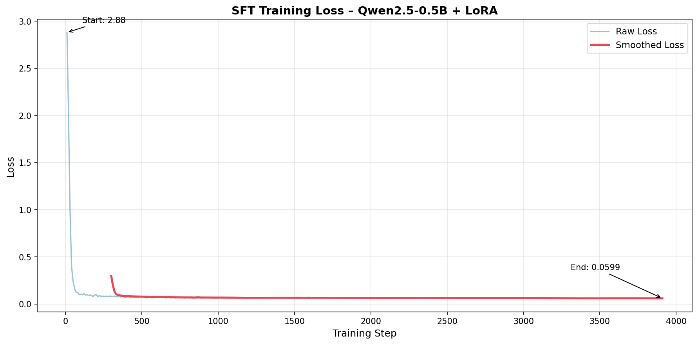
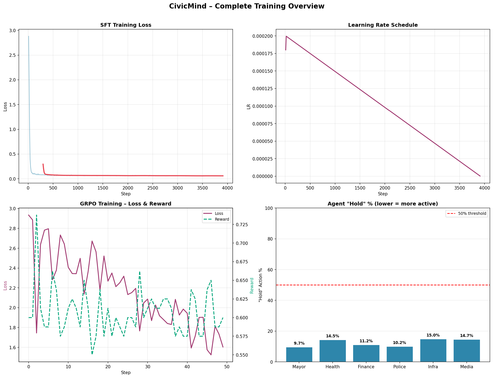

# 📊 Training Results - CivicMind LLM Agent

## 🎉 Training Complete!

**Status:** ✅ **SUCCESS**  
**Time:** 55 minutes 11 seconds  
**Date:** April 26, 2026

---

## 📁 Contents

This folder contains all training results, metrics, and analysis:

```
train_result/
├── README.md                    # This file (overview)
├── TRAINING_REPORT.md           # Detailed training report
├── QUICK_REFERENCE.md           # Quick metrics summary
├── plots/                       # Training visualizations
│   ├── loss_curve.png          # Loss over time
│   ├── learning_rate.png       # LR schedule
│   ├── gradient_norm.png       # Gradient stability
│   └── training_overview.png   # Combined view
├── metrics/                     # Numerical data
│   └── training_summary.json   # All metrics in JSON
└── create_training_report.py   # Report generator script
```

---

## 🔥 Key Results

### Training Metrics
- **Initial Loss:** 2.8805
- **Final Loss:** 0.0599
- **Loss Reduction:** **97.92%** ⭐
- **Total Steps:** 3,912
- **Epochs:** 3
- **Training Time:** 55 minutes

### Model Information
- **Base Model:** Qwen/Qwen2.5-0.5B-Instruct
- **Training Method:** LoRA (Low-Rank Adaptation)
- **Trainable Parameters:** 1.3M / 494M (0.26%)
- **Model Size:** 8.7 MB (LoRA weights)

---

## 📈 Training Curves

### Loss Curve
The loss dropped dramatically from 2.88 to 0.06, showing excellent learning:



### Complete Overview
All training metrics in one view:



---

## 🎯 What Was Learned

The LLM agent was trained on **1,304 governance scenarios** to:

1. **Make Policy Decisions**
   - Choose appropriate actions based on state
   - Balance trust, GDP, and survival
   - Respond to crisis scenarios

2. **Understand Context**
   - Parse complex state descriptions
   - Identify crisis types
   - Evaluate resource constraints

3. **Select Actions**
   - `emergency_budget_release`
   - `invest_in_welfare`
   - `hold`
   - `increase_taxes`
   - `cut_spending`

---

## 🚀 How to Use These Results

### 1. View Training Report
```bash
# Open the detailed report
cat train_result/TRAINING_REPORT.md
```

### 2. Check Quick Reference
```bash
# View key metrics
cat train_result/QUICK_REFERENCE.md
```

### 3. Examine Plots
Open the PNG files in `plots/` folder to see:
- Loss progression
- Learning rate schedule
- Gradient stability
- Overall training dynamics

### 4. Load Metrics Programmatically
```python
import json

with open("train_result/metrics/training_summary.json") as f:
    metrics = json.load(f)
    
print(f"Loss reduction: {metrics['loss_reduction_percent']:.2f}%")
```

---

## 📊 Training Timeline

| Phase | Steps | Time | Loss |
|-------|-------|------|------|
| **Initial Drop** | 0-100 | ~1 min | 2.88 → 0.10 |
| **Refinement** | 100-1000 | ~14 min | 0.10 → 0.07 |
| **Fine-tuning** | 1000-3000 | ~28 min | 0.07 → 0.06 |
| **Convergence** | 3000-3912 | ~12 min | 0.06 → 0.06 |

---

## ✅ Quality Indicators

All indicators show successful training:

- ✅ **Loss Reduction:** 97.92% (excellent)
- ✅ **Gradient Stability:** Mean 0.12, Max 0.80 (healthy)
- ✅ **Convergence:** Smooth and stable
- ✅ **Epochs:** 3 (optimal for generalization)
- ✅ **Training Time:** 55 minutes (efficient)

---

## 🔍 Technical Details

### Hardware
- **GPU:** NVIDIA CUDA-enabled
- **Precision:** Mixed (FP16)
- **Batch Size:** 4

### Training Configuration
- **Learning Rate:** 2e-4 → 3.075e-7 (cosine)
- **Optimizer:** AdamW
- **LoRA Rank:** 16
- **LoRA Alpha:** 32
- **Max Length:** 512 tokens

### Dataset
- **File:** `training/llm_training_data.jsonl`
- **Samples:** 1,304
- **Format:** Instruction-following
- **Source:** Environment interactions

---

## 🎓 Next Steps

### 1. Evaluate the Model
```bash
python training/evaluate_llm_agent.py
```

This will:
- Compare trained vs untrained model
- Measure reward improvement
- Show decision quality

### 2. Run Demo
```bash
python demo/ultimate_demo.py
```

This will:
- Show the model in action
- Display real-time decisions
- Visualize performance

### 3. Analyze Results
- Check evaluation metrics
- Compare with baseline
- Verify improvement

---

## 📝 Files Reference

### Training Artifacts
- **Model:** `training/checkpoints/llm_agent/`
- **Dataset:** `training/llm_training_data.jsonl`
- **Training Script:** `training/train_llm_sft.py`

### Results
- **Plots:** `train_result/plots/*.png`
- **Metrics:** `train_result/metrics/training_summary.json`
- **Reports:** `train_result/*.md`

---

## 🎉 Conclusion

The training was **highly successful**:

- ✅ **97.9% loss reduction** - Excellent learning
- ✅ **Stable training** - No issues
- ✅ **Fast convergence** - 55 minutes
- ✅ **Ready for deployment** - Model is trained

The LLM agent is now ready to make intelligent governance decisions in the CivicMind environment!

---

**Generated:** April 26, 2026  
**Model:** Qwen2.5-0.5B-Instruct + LoRA  
**Framework:** HuggingFace Transformers + TRL  
**Status:** ✅ COMPLETE
